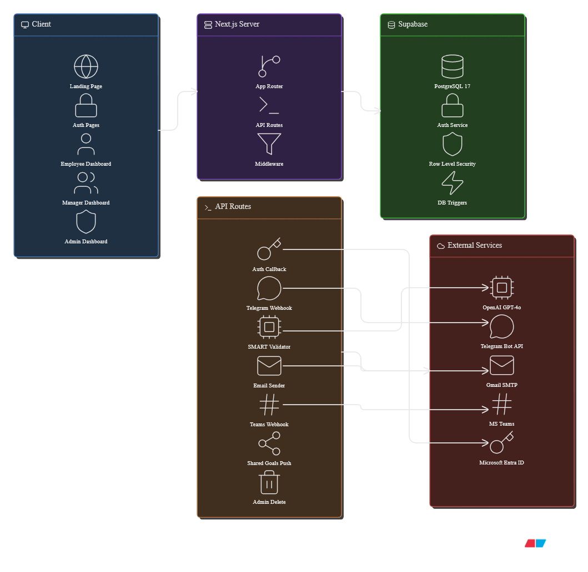
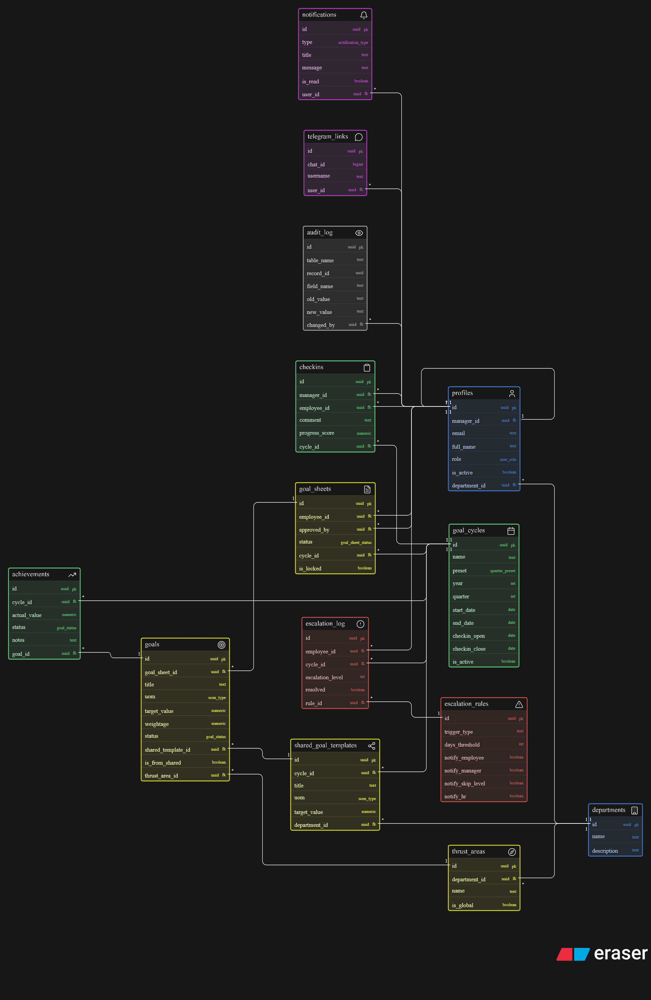
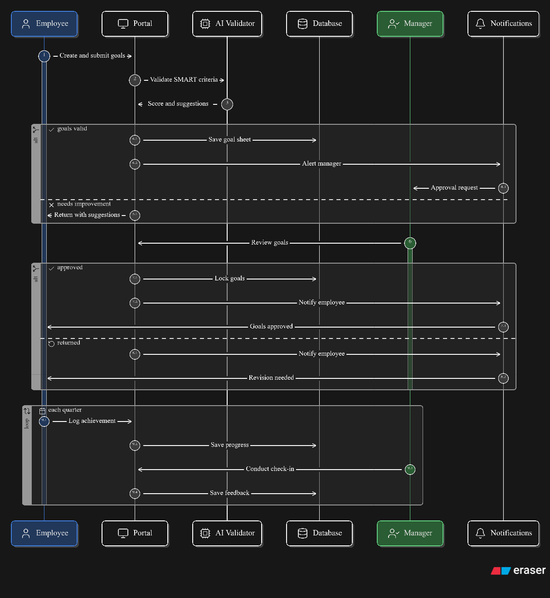
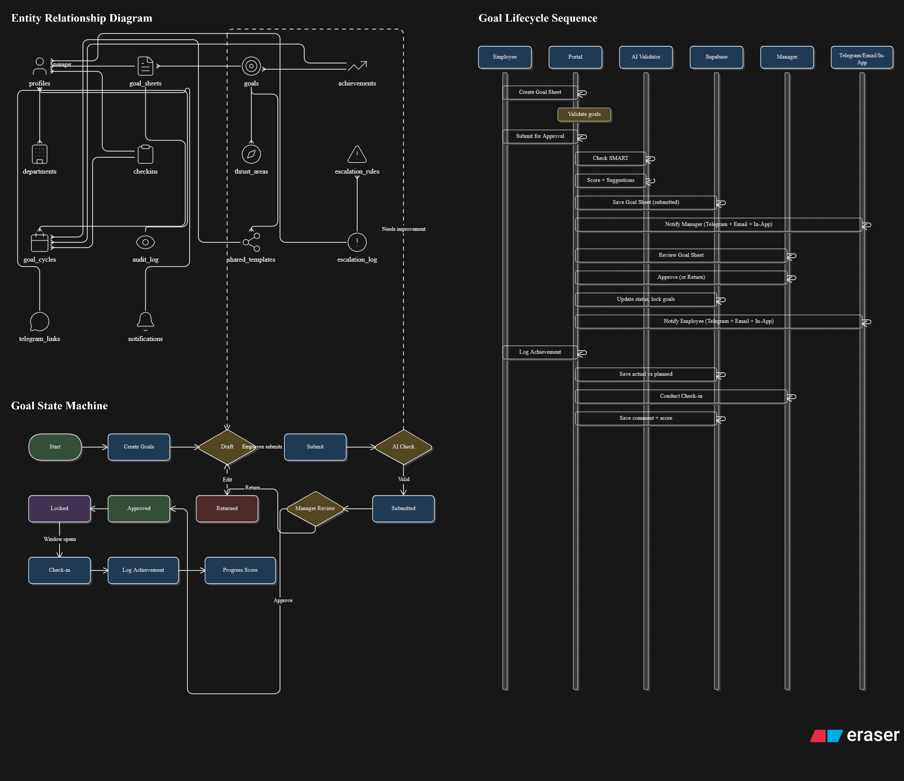

# BergSpace — Goal Setting & Tracking Portal

> Built for **ATOMQUEST Hackathon 1.0** by Atomberg

**[Live Demo](https://atomquest-sand.vercel.app)** · **[Source Code](https://github.com/Arpit-oo/bergspace)**

## Demo Credentials

| Role | Email | Password |
|------|-------|----------|
| Employee | employee@bergspace.com | demo123456 |
| Manager | manager@bergspace.com | demo123456 |
| Admin | admin@bergspace.com | demo123456 |

Microsoft SSO also available on login page.

---

## Architecture

### System Overview


### Entity Relationship Diagram


### Goal Lifecycle Sequence


### Combined View (ER + State Machine + Sequence)


---

## Features

### Core (Must-Have)
- Goal creation with weighted validation (100% total, 10% min, 8 max)
- Thrust areas, UoM (Numeric/Percentage/Timeline/Zero-based)
- Manager approval workflow (approve, inline edit, return with reason)
- Goal locking on approval + admin unlock
- Shared goals (push KPI, read-only title/target, achievement sync via DB trigger)
- Quarterly check-ins (actual vs planned, configurable windows)
- Manager check-in module (structured comments, progress scores)
- Reports with CSV/Excel export
- Completion dashboard
- Audit trail (human-readable, every post-lock change)

### Bonus
- **Microsoft Entra ID SSO** — multi-tenant, any Microsoft account
- **Email notifications** — Gmail SMTP, 6 event types, branded HTML
- **Microsoft Teams** — adaptive card webhooks for all events
- **Telegram Bot (@BergSpacebot)** — approve/return from chat, one-tap check-ins
- **Escalation module** — configurable rules, chain, intervention dashboard
- **Analytics** — QoQ trends, donut charts, bar charts, heatmaps, manager effectiveness

### Beyond Requirements
- AI SMART Goal Validator (OpenAI GPT-4o-mini, sequential S-M-A-R-T animation)
- Broadcast/Announcement system (multi-channel: in-app + email + Telegram)
- Role selection for SSO users
- Admin employee editor (assign roles, departments, managers)
- Accessibility settings (font size, reduce animations, high contrast)
- Mobile responsive
- 52 E2E tests (Playwright)

---

## Tech Stack

| Layer | Technology |
|-------|-----------|
| Frontend | Next.js 16, TypeScript, Tailwind, shadcn/ui, Recharts |
| Backend | Supabase (PostgreSQL 17, Auth, RLS) |
| AI | OpenAI GPT-4o-mini |
| Bot | Telegram Bot API |
| Email | Nodemailer + Gmail SMTP |
| Auth | Supabase Auth + Microsoft Entra ID |
| Deploy | Vercel |
| Tests | Playwright (52 E2E) |

---

## How to Use BergSpace

### As an Employee
1. **Login** → Dashboard shows goal status + current cycle info
2. **My Goals** → Create goal sheet with thrust areas, targets, weightages
3. **AI validates** your goals against SMART criteria before submission
4. **Submit** → Manager gets notified (in-app + email + Telegram)
5. **After approval** → Goals lock. Track progress in **My Check-ins** during quarterly window
6. **Notifications** → View alerts, link Telegram bot for mobile updates

### As a Manager
1. **Dashboard** → Team stats, pending approvals, recent activity
2. **Approvals** → Review submitted sheets, inline edit, approve or return with reason
3. **Check-ins** → View team's planned vs actual, add comments, see progress scores
4. **Shared Goals** → Create KPI templates, push to employees
5. **Announcements** → Broadcast messages via in-app, email, Telegram
6. **Telegram** → Approve/return goals directly from chat

### As an Admin
1. **Dashboard** → Org-wide stats, escalations, audit entries
2. **Employees** → Edit roles, departments, managers. View/delete goal sheets
3. **Goal Cycles** → Create quarterly windows with presets
4. **Escalations** → Configure rules, view intervention dashboard
5. **Reports** → Org-wide achievement + completion data with export
6. **Analytics** → Charts, heatmaps, distribution analysis
7. **Settings** → SSO config, email status, Telegram, Teams

---

## Setup

```bash
git clone https://github.com/Arpit-oo/bergspace.git
cd bergspace
npm install
cp .env.example .env.local
# Fill in keys
npm run dev
```

## Testing

```bash
npx playwright test
# 52 tests covering all roles, pages, features
```

---

## Database

15 tables · 45+ RLS policies · 4 DB triggers

Key triggers: auto profile creation, shared goal achievement sync, weighted progress scoring.

---

Built by **Arpit Walia** · [LinkedIn](https://linkedin.com/in/arpit-walia) · [GitHub](https://github.com/Arpit-oo)

Made with love for ATOMQUEST Hackathon 1.0
